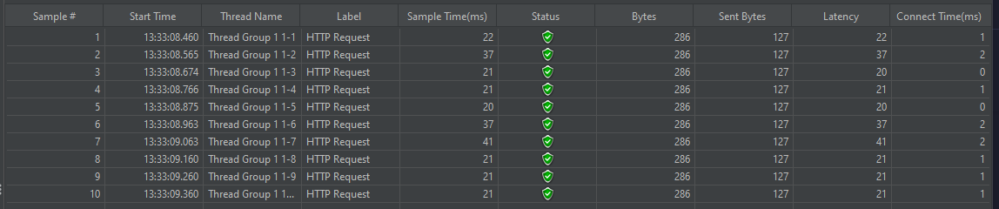

# Advance Programming Class repository by Muhammad Fadhlan Karimuddin (2306245011)

## Performace Testing Result

### GUI

all-student

all-student-name

highest-gpa

### CLI

all-student

all-student-name

highest-gpa

## Reflection

### 1. What is the difference between the approach of performance testing with JMeter and profiling with IntelliJ Profiler in the context of optimizing application performance?

Performance testing with JMeter helps you evaluate your application’s behavior from an external perspective. It simulates real-world scenarios by generating concurrent requests from many users, thus stressing the system and capturing metrics like throughput, latency, and resource utilization. This type of testing gives you insight into how the application performs under load and helps identify scalability issues, capacity problems, and response time bottlenecks. In contrast, profiling with IntelliJ Profiler focuses on the internal workings of your application. It provides a detailed breakdown of method calls, CPU time, memory usage, and other low-level metrics. Tools like flame graphs enable you to see which parts of the code or which specific methods are consuming the most resources. While JMeter shows you the overall performance impact from a client’s perspective, IntelliJ Profiler gives you a microscopic view that is vital for pinpointing inefficient code and understanding execution flow within the application.

### 2. How does the profiling process help you in identifying and understanding the weak points in your application?  

Profiling tools help by providing detailed metrics on how much time each method or function takes during execution. This granular data allows you to quickly spot which methods are bottlenecks by comparing their CPU usage and execution durations. In addition, profilers often offer visualizations, such as flame graphs or call trees, which reveal the hierarchical relationship between method calls and highlight nested performance issues. This makes it easier to identify inefficient algorithms, redundant computations, or even resource-intensive database calls. By systematically analyzing this data, you can understand not only where the performance issues are occurring but also the context in which these methods get executed, which is critical for planning targeted optimizations.

### 3. Do you think IntelliJ Profiler is effective in assisting you to analyze and identify bottlenecks in your application code?  

Yes, IntelliJ Profiler is very effective in helping to analyze and identify bottlenecks because it provides a visual representation of how the code executes. The flame graphs and call trees allow you to quickly see which methods consume the most CPU time, making it easier to pinpoint problems without manually reviewing each method’s performance. The intuitive interface, along with real-time monitoring metrics, improves the ease and speed of the diagnostic process. This visualization aids in understanding the overall execution flow as well as the impact of individual methods on application performance, leading to more informed decisions when optimizing the code.

### 4. What are the main challenges you face when conducting performance testing and profiling, and how do you overcome these challenges?  

One of the main challenges in performance testing is determining whether the application can handle multiple users simultaneously and maintain acceptable response times under stress. This requires creating realistic test scenarios and ensuring that the test environment closely mimics the production environment. On the profiling side, the challenge lies in pinpointing the specific lines or methods that cause performance issues, especially in complex applications where resource consumption may be spread over several layers. To overcome these challenges, I use a combination of testing tools – using JMeter for external load and stress testing, and IntelliJ Profiler for internal analysis. I also ensure that I replicate production conditions as closely as possible. Iterative testing, combined with continuous monitoring and adjustments based on collected metrics, helps isolate and address performance bottlenecks effectively.

### 5. What are the main benefits you gain from using IntelliJ Profiler for profiling your application code?  

IntelliJ Profiler offers several key benefits when optimizing application code. It provides an easy-to-use interface and responsive performance feedback, which allows for quick identification of performance hotspots. The compiler visualizations, such as flame graphs and detailed call trees, offer comprehensive insights into how different parts of the code interact and contribute to overall execution time. This immediate feedback loop helps in validating hypotheses about potential bottlenecks and guides the prioritization of optimization efforts. Additionally, it simplifies the process of measuring the impact of code changes, making it easier to iterate and refine performance improvements without compromising on code quality.

### 6. How do you handle situations where the results from profiling with IntelliJ Profiler are not entirely consistent with findings from performance testing using JMeter?  

When there are discrepancies between profiling results and performance testing outcomes, I begin by verifying that both tests are conducted in environments that closely resemble production in terms of configuration and workload. I then review the profiling settings such as sampling intervals and consider whether the profiling tool might have introduced overhead or missed transient issues that manifest under load. Cross-validating the results with log analysis, additional monitoring tools, or even alternative profiling techniques helps build a more complete picture. I also look for patterns or specific scenarios where the inconsistencies occur, adjusting either the workload simulation in JMeter or fine-tuning the profiler configuration to capture more relevant data. This iterative process ensures that the optimization decisions are based on comprehensive and accurate information.

### 7. What strategies do you implement in optimizing application code after analyzing results from performance testing and profiling? How do you ensure the changes you make do not affect the application's functionality?  

After gathering insights from both performance testing and profiling, my optimization strategy typically involves a combination of code refactoring, efficient algorithm implementation, and improvements in database query performance. I identify the most resource-intensive methods and re-evaluate them for potential refactoring, improving data structures, caching frequently used results, or even parallelizing tasks where applicable. To ensure that these changes do not affect the application’s functionality, I adopt a test-driven development (TDD) approach that involves writing comprehensive unit and integration tests before making any modifications. Continuous integration pipelines help run these tests automatically after every change, providing rapid feedback on any functional regressions. Additionally, I conduct further performance tests post-optimization to compare the results against baseline metrics, ensuring that the improvements are effective and that the application still meets its requirements.